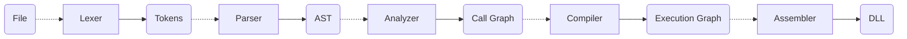

# Architecture

```mermaid
graph LR;
File(File) -.-> Lexer --> Tokens(Tokens) -.-> Parser --> AST(AST) -.-> Analyzer --> CallGraph(Call Graph) -.-> Compiler --> ExecutionGraph(Execution Graph) -.-> Assembler --> DLL(DLL)

```